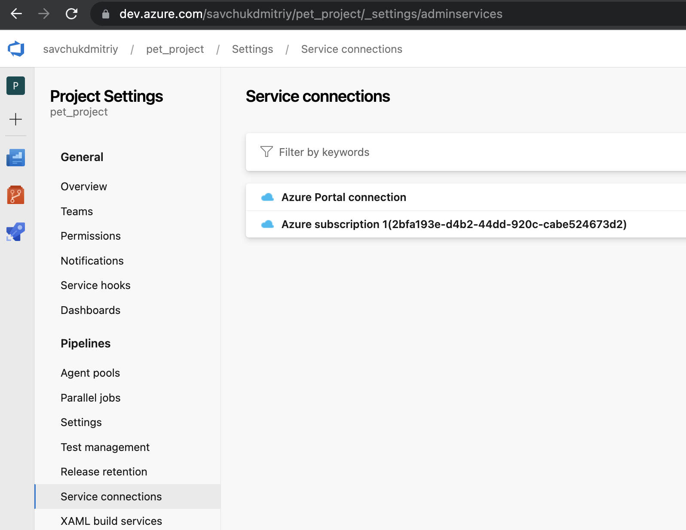
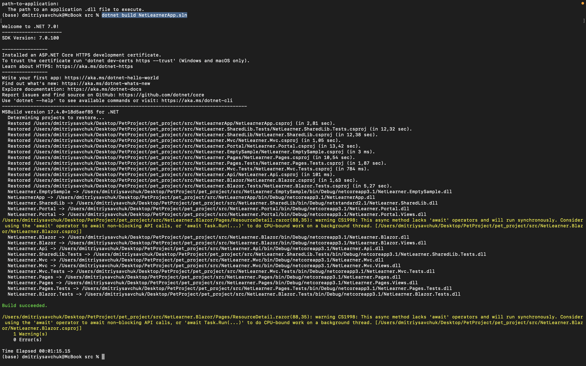
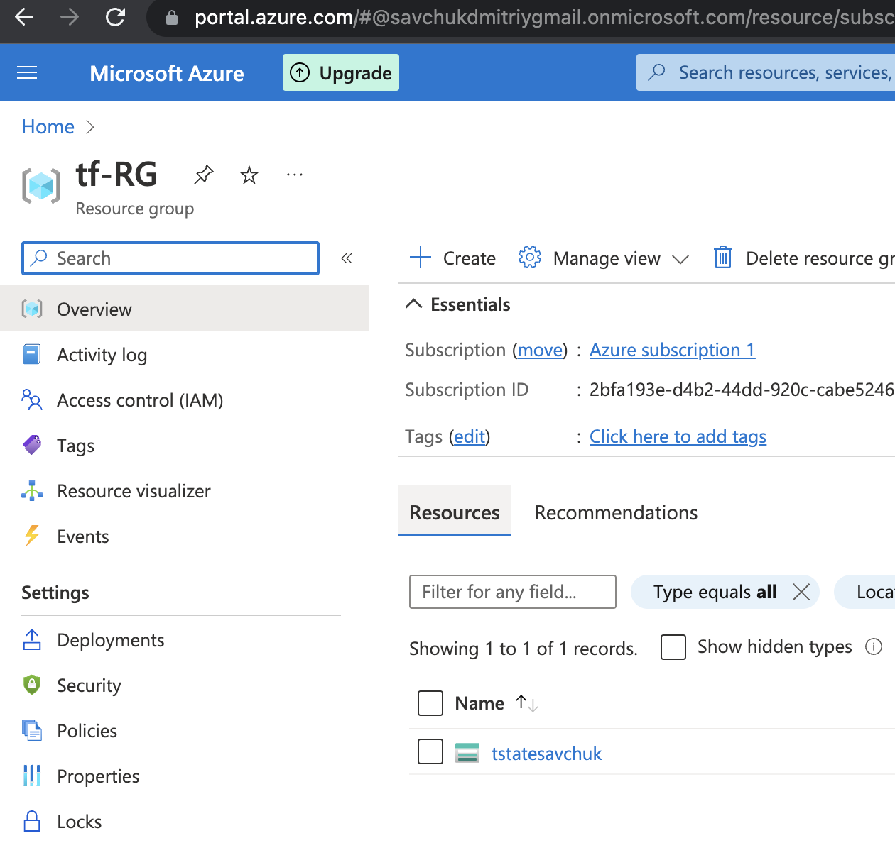
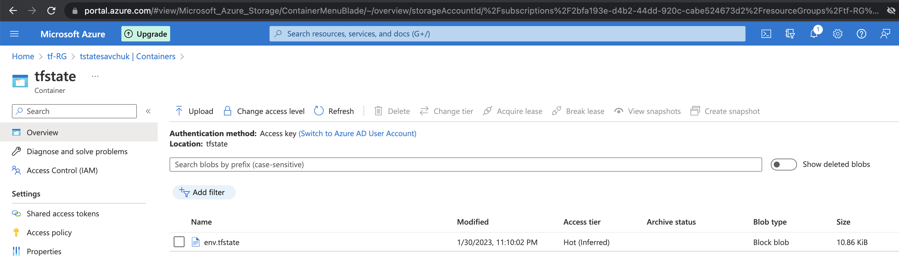
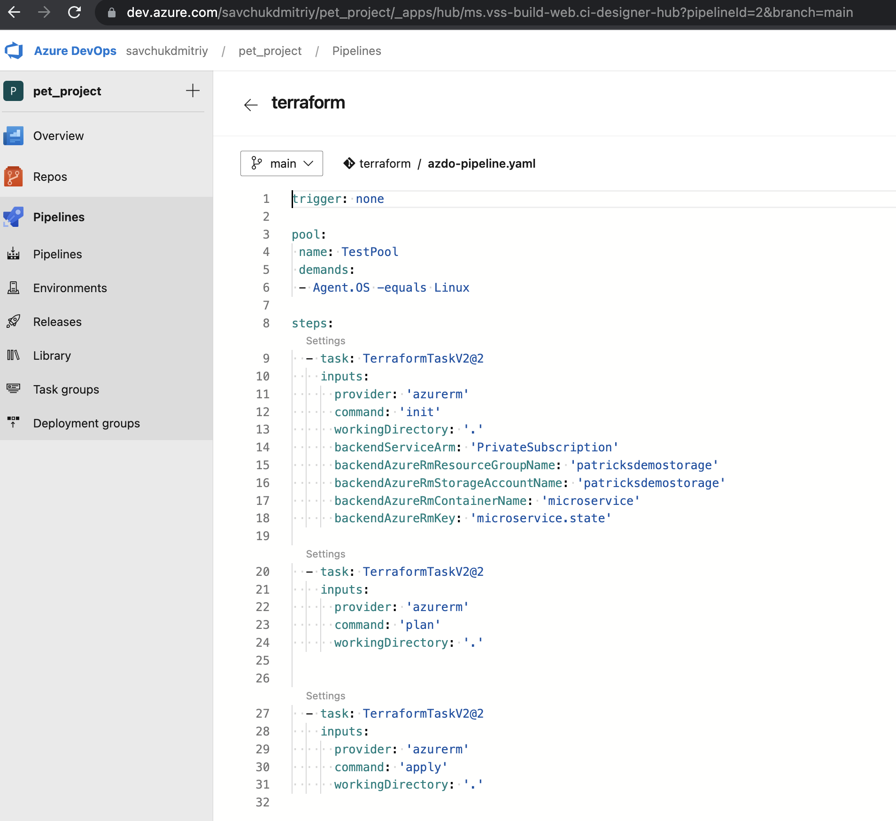
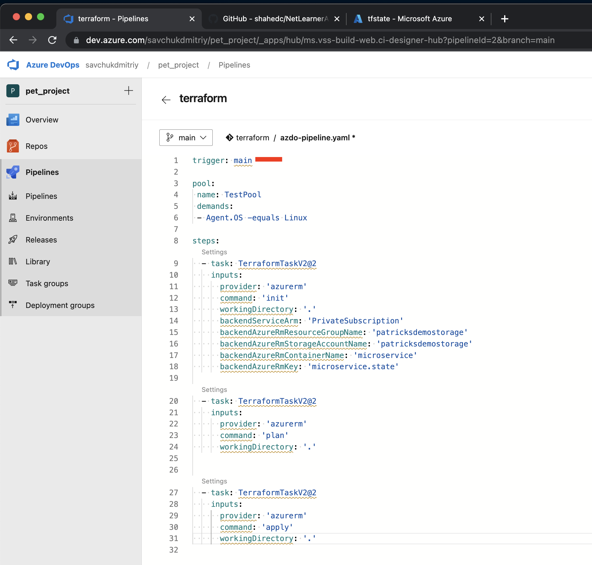
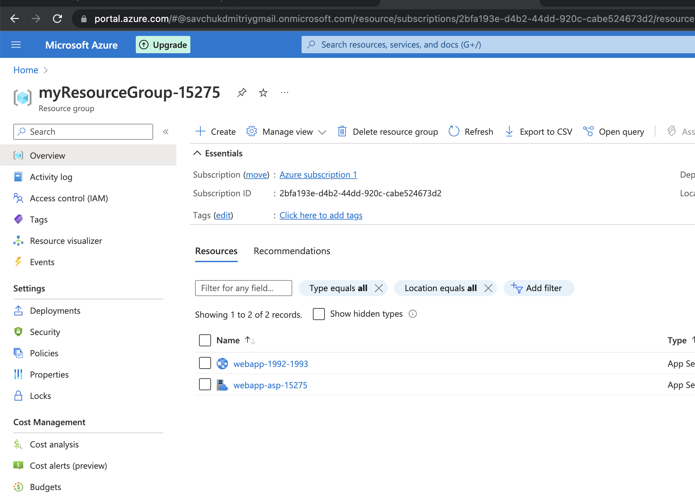
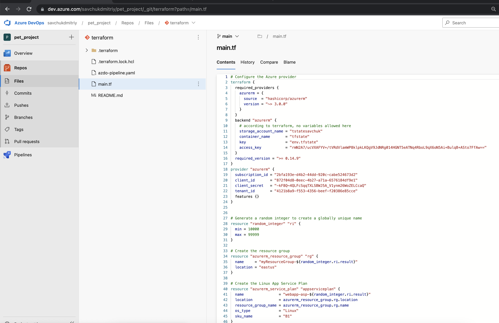
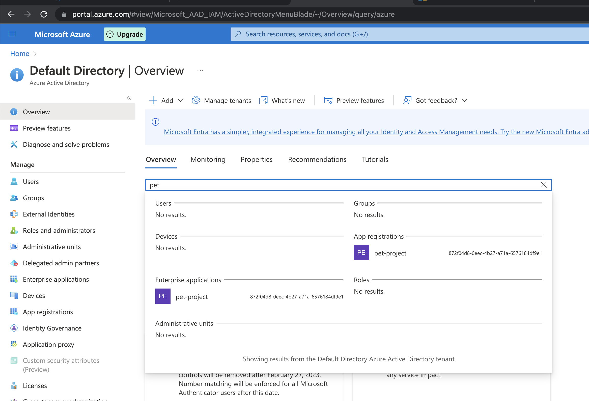

# Part 1 – Configure application

1.	Create a service connection in a Azure DevOps project to your subscription - 

2.	Find a .net pet project for the experiments

3.	Build your app locally .net project via dotnet tool. dotnet restore/build/run

4.	Create an Azure DevOps repo You can use import repository to import from existing source control version like github

Repo was created in previous screenshot and my .NET project was moved inside in pet-project Repo

5.	Create a branching policy for you application. Added yourself as a reviewer. As branching strategy use a github flow (It will be applied by default when you strict commit to your main branch)

Policy was created with reviewer as myself

# Part 2 – Configure a pipeline to deploy infrastructure 

1.	Create a separate resource group and deploy azure storage account 

Storage account nad RG were created 

2.	Create a container with the name “tfstate” and remember the name. use portal settings 

Container and TF state file were created (terraform file created automatically after TF execution)

# Part 2.2 – Create a terraform pipeline

1.	Create a yaml pipeline with the following steps: terraform install, terraform init, terraform plan/apply. Plan is an optional one 

Pipeline created for terraform execution

2.	Inside yaml pipeline add trigger to main branch. The scenario – when main is updated, pipeline should run automatically

Main branch is set up for automation

3.	Added 3 steps – terraform install, terraform init, terraform plan/apply. Plan is an optional one. You may add it as 4th step

Resources which created by terraform

Terraform manifest

# Part 3 – Create a deploy pipeline to app service

1.	Add yml pipeline to the application folder

You can see pipeline on 3 screenshot, where we building our application

2.	Your pipeline structure should contain 2 stages. 1st – build, create zip archieve, and publish an artifact. 2nd – download an artifact and deploy it to azure app service 

3.	To deploy .zip to app service use azure app service deployment task

Same on previous script, separate job for dpeloyment application to app service 

# Service connection 

